## CH_2_Node.js 的模块化开发


## 1 使用原因

### 1.1 JS 的弊端

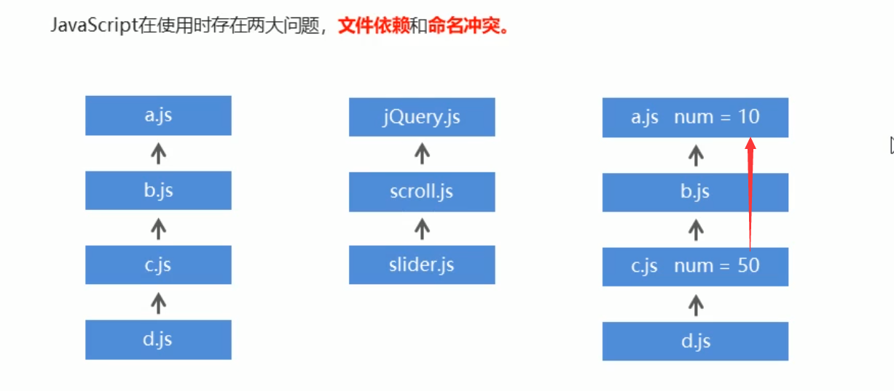

### 1.2 软件的模块化开发

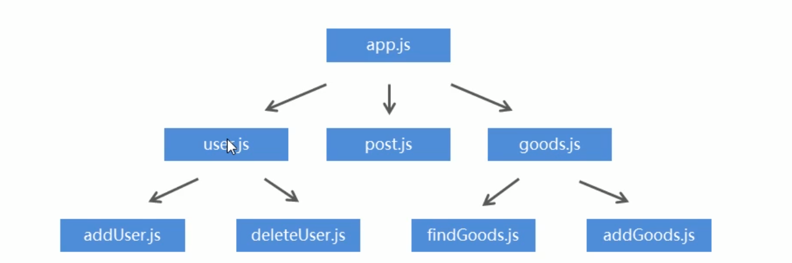

### 1.3 模块化使用

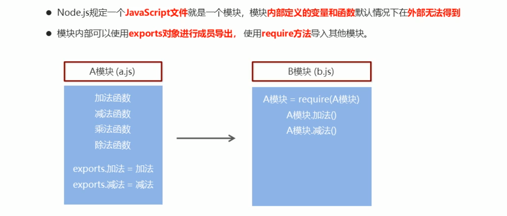

※ 导出的方式

```js
exports.a = a
Module.exports.a = a
```

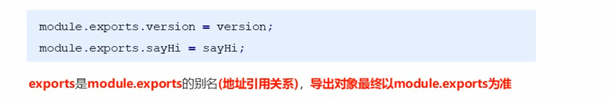


## 2 系统模块

### 2.1 什么是系统模块

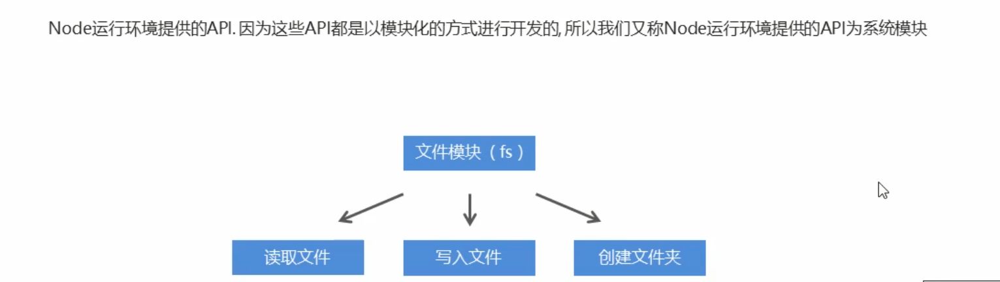

### 2.2 文件模块 fs

> fs : file system

#### （1）读取

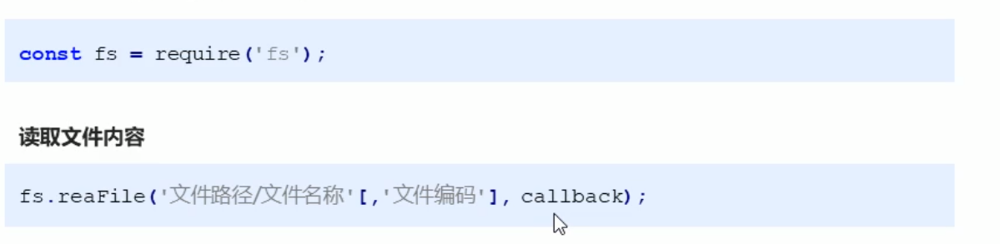

* 示例

> node 以错误优先，每个 callback 都有 err 参数
>
> * 文件读取出错，err 为一包含错误信息的对象
> * 读取正确，err 为 null，doc 为结果

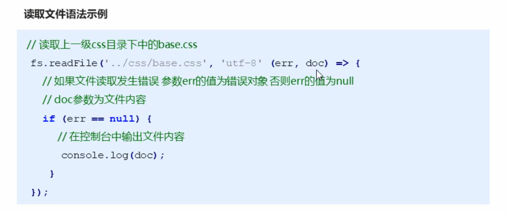

#### （2）文件写入

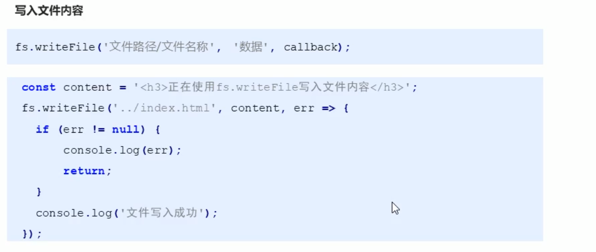

### 2.3 path 模块的路径操作

#### a. 为什么要路径拼接？


而该方法会自动判断系统，进行拼接

#### b. 语法

```js
path.join('path1','path2',...)
```

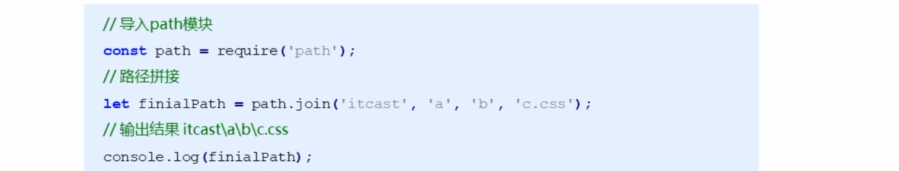

#### c. 相对路径 / 绝对路径


```js
// 获得绝对路径并使用
console.log(path.join(__dirname, '05.textfile.txt'));
fs.readFile(path.join(__dirname, '05.textfile.txt'), 'utf8', (err, doc) => {
    console.log(doc);
})
```


## 3 第三方模块

### 3.1 什么是第三方模块

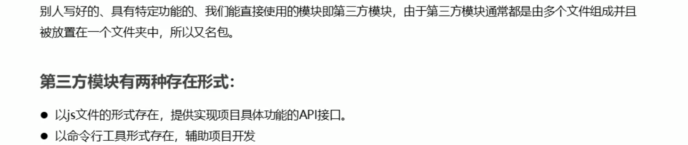

### 3.2 如何获取？

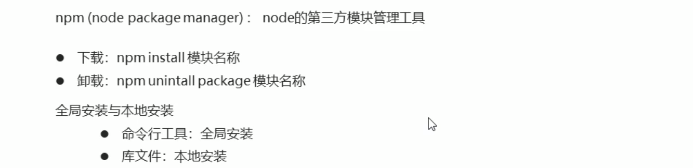

### 3.3 第三方模块 nodemon

### 3.4 nrm

* nrm ls 查看可选项
* nrm use taobao 选择服务器


## 4 package.json 的作用

* 记录安装的插件和版本
* 使用 npm install 即可自动查找到 package.json，并下载其记录的 dependencies

#### 4.1 项目依赖

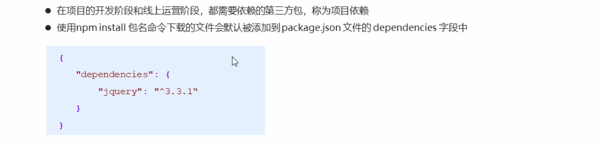

#### 4.2 开发依赖

> 因为线上不需要使用，所以需要专门整一个 dev 用的记录

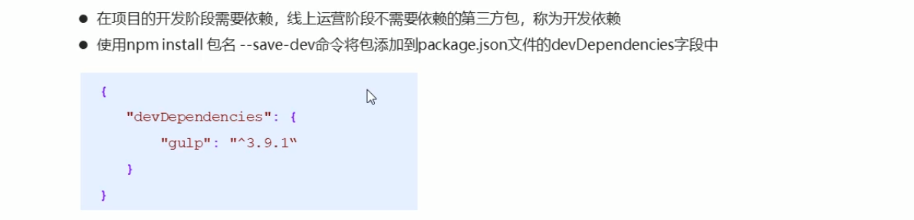

```js
npm install 	// 全部依赖
npm install --production // 仅项目
```

#### 4.3 package-lock.json 的作用

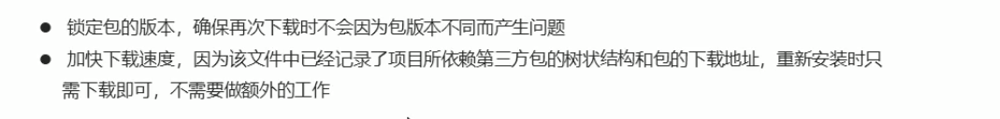

#### 4.4 别名 script

```js
  "scripts": {
    "test": "echo \"Error: no test specified\" && exit 1",
    "build": "nodemon index.js"
  },
```


## 5 node 的模块加载机制

### 5.1 模块查找规则 - 有路径没后缀

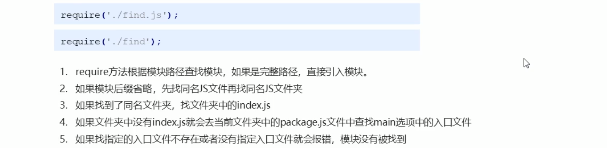

### 5.2 规则 - 无路径无后缀

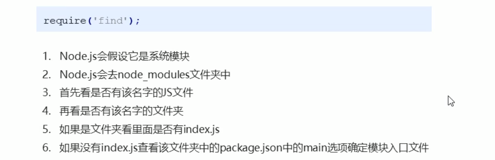

