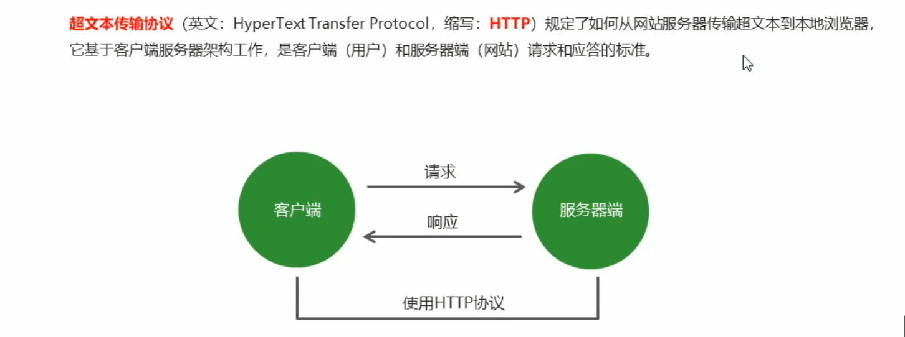

# CH_3_服务器概念


## 1 基础概念

### 1.1 网站的组成


### 1.2 Node 网站服务器


### 1.3 IP地址

### 1.4 域名

### 1.5 端口

通过 IP 找到服务器时，根据自己需要的服务的类型，连接不同的端口


### 1.6 URL


网站请求默认是 80 端口，浏览器会自己帮忙加上去。

### 1.7 开发过程中，客户端和服务端的说明


## 2 创建 web 服务器

* 基本语法示例


## 3 HTTP 协议

### 3.1 协议的概念

HTTP : HyperText Transfer Protocol



### 3.2 报文


### 3.3 请求报文


```js
// 获取请求报文的值
req.headers['accept']
```

### 3.4 响应报文

#### a. 状态码

* 设置响应头

```js
res.writeHead(状态码, {
    // 响应报文信息
    'content-type' : 'text/plain;charset=utf8'	// 表示内容纯文本, 编码类型为 utf8
})
```

#### b. 内容类型

* text / html
* text / css
* application / javascript
* image / jepg
* application / json


## 4 请求和响应处理

### 4.1 请求参数


### 4.2 GET 参数

* 地址栏的 query 部分

  ```js
  http://localhost:3000/?name=zhagnsan&age=20
  ```

### 4.3 POST 参数


### 4.4 静态资源

http:// ....... /logo.png

### 4.5 动态资源


### 4.6 路由


