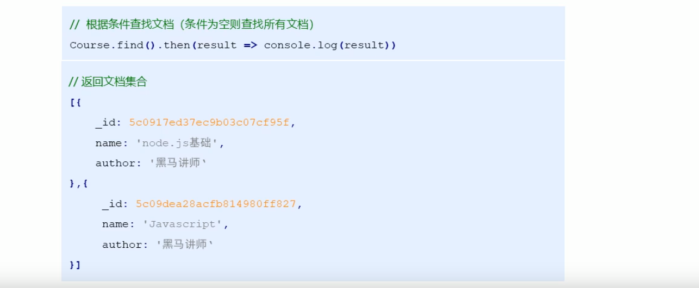
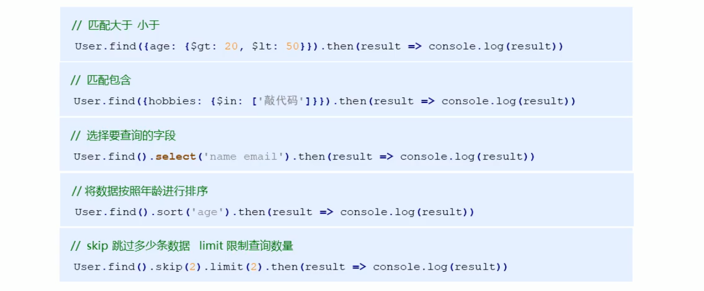

## 1 数据库概述及环境搭建

### 1.1 为什么要使用数据库


### 1.2 什么是数据库 


### 1.3 MongoDB 数据库 / MongoDB 可视化软件

### 1.4 相关概念


### 1.5 Mongoose 第三方包

* 使用 Node.js 操作 MongoDB 数据库需要依赖 Node.js 第三方包

  ```js
  npm i mongoose
  ```

### 1.6 启动 MongoDB

```js
// 需要管理员模式
net start / stop mongodb
```

### 1.7 连接数据库

```js
mongoose.connect('mongodb://localhost/playground',{ useNewUrlParser: true, useUnifiedTopology: true })
    .then(value => {
        // console.log(value);
        console.log('连接成功');
    })
    .catch(err => {
        console.log(err);
    })
```


## 2 MongoDB 的增删查改操作

### 2.0 创建数据库

没有 playground 库的话会创建

```js
mongoose.connect('mongodb://localhost/playground',{ useNewUrlParser: true, useUnifiedTopology: true })
    .then(value => {
        // console.log(value);
        console.log('连接成功');
    })
    .catch(err => {
        console.log(err);
    })
```


### 2.1 创建集合

* 设定集合规则
* 用 mongoose.model(集合名称，集合规则) 来创建集合
  会返回一个构造函数，可以用来创建集合内部的文档


### 2.2 创建文档

#### 方法1 分步

* 创建集合的文档实例
* 调用 save 方法保存到数据库中


#### 方法2 一步


### 2.3 数据导入


```
mongoimport -d ... -c ... --file ...
```

### 2.4 查询文档

#### a. find / findOne 方法



#### b. $lt / ​\$gt 匹配 小于 / 大于 的结果

#### c. select() 筛选查询结果

#### d. sort(' str ') 排序

* 默认升序
* 使用 '-str' 设置降序

#### e. skip() 跳过部分数据，limit() 限制查询数量



### 2.5 删除文档

#### a. 删除单个 findOneAndDelete({options}).then( res => {})

* 返回的是被删除的数据

#### b. 删除多个 deleteMany({}).then( res => {})

* 返回值 { n : 删除的数据个数, ok : boolean }


### 2.6 更新、修改文档

#### a. 更新单个 updateOne({查询条件}，{要修改的 key : value}).then( res => { } )

* 实例

```js
```

* 返回值
  { n : 个数, ok : boolean}

#### b. 更新多个 updateMany({查询条件}, {要修改的 key : value}).then( res => {} )

### 2.7 mongoose 验证

就是在集合规则设定时，对传入字段设置规则。


### 2.8 集合关联


* 整体实现示例
  
  
* 结果

  ```js
  // author 里面不会是之前设置的 _id 了，而是通过这个 _id 查找到的 User 里面的数据
  // find() 就是对所有数据都进行关联
    {
      _id: 608f804c4d87ff480478c6f1,
      title: 'title1',
      author: null,	// 根据这个 author 的值在 User 里面没有找到对应的数据
      __v: 0
    },
    {
      _id: 608f80bdda10550c0cd79ead,
      title: 'title1',
      author: { _id: 608f804c4d87ff480478c6f0, username: 'xkh', __v: 0 },
          		// 根据这个 author 的值在 User 里面找到了 'xkh' 这条数据
      __v: 0
    }
  ```

  

### 2.9 案例：用户信息增删改查


