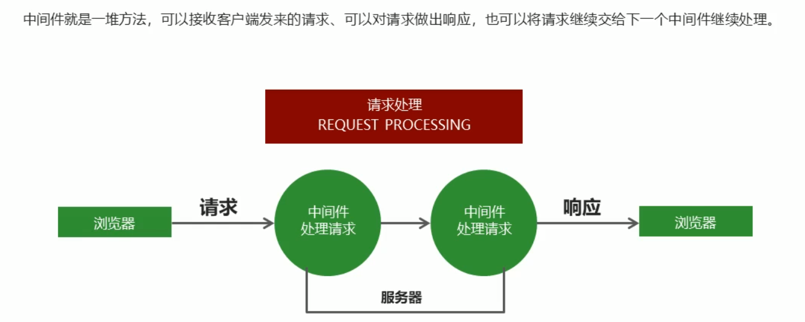
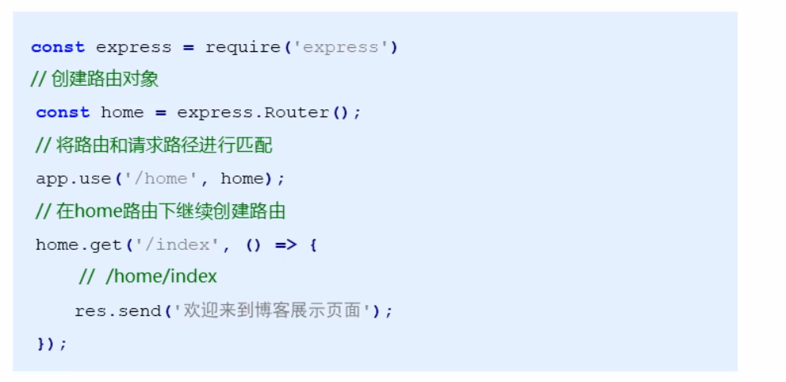

# Express框架


## 1 框架简介

### 1.1 框架特性


### 1.2 对比路由实现


### 1.3 获取请求参数


### 1.4 框架案例

```js
const express = require('express');

// 创建网站服务器
const app = express();

app.get('/', (req, res)=>{
    // send 的好处
    // 1 自动监测响应内容的类型(文本..?)
    // 2 自动设置http状态码
    // 3 自动设置响应的内容类型和编码
    res.send('hello express')
})

app.get('/list', (req, res) =>{
    res.send({name:'123', age:20})
})
// 监听端口
app.listen(3000);
console.log('start!');


```


## 2 中间件

### 2.1  基本使用简介




```js
const express = require('express');

// 创建网站服务器
const app = express();

app.get('/request', (req, res,next)=>{
    req.name = 'zs';
    next();	// 需要下一个中间件继续处理
})

app.get('/request', (req, res)=>{
    // console.log(req);
    // console.log(res);
    res.send(req.name)
})
// 监听端口
app.listen(3000);
console.log('start!');
```

### 2.2 app.use 使用方法

> 对所有的请求方式 get / post /push .... 都可以用 app.use 匹配


### 2.3 应用

* 路由保护
* 维护
* 自定义404


## 3  Express 请求处理

### 3.1 构建模块化路由

#### 3.1.1 二级路由



#### 3.1.2 模块化代码


### 3.2 GET 参数的获取


### 3.3 Post 参数获取


### 3.4 路由参数


### 3.5 静态资源处理


## 4 模板引擎 express-artg-template

### 4.1 基本使用


### 4.2 app.locals 对象

> 公共数据只需要查询一次


